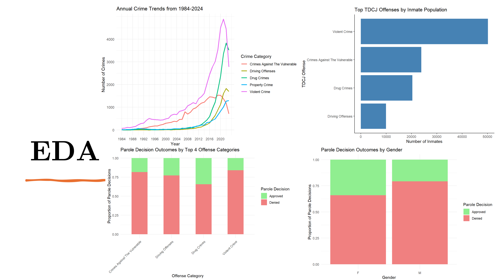
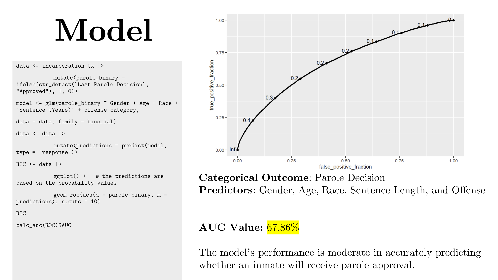
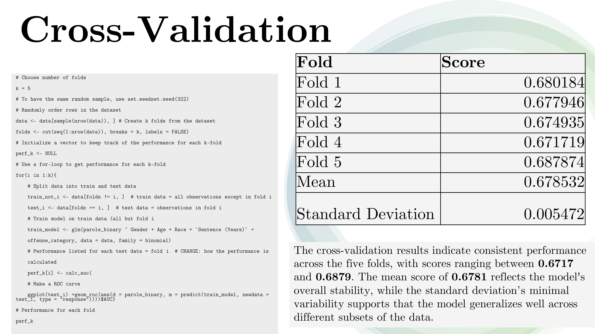

# Analysis of Incarceration in Texas

## Overview
This project analyzes incarceration data in Texas to understand the demographic and offense-related factors influencing parole decisions. Using data provided through the City of Austin Open Data Portal, the study explores how race, gender, age, sentence length, and offense type affect parole outcomes.

The work combines **data cleaning, exploratory analysis, and statistical modeling (logistic regression)** to highlight trends and evaluate predictive performance.

---

## Dataset
- **Source**: City of Austin Open Data Portal  
- **Scope**: Current inmates in Texas  
- **Variables analyzed**:  
  - Demographics: Race, Gender, Age  
  - Sentence length  
  - Offense committed  
  - Parole decision outcome  

---

## Methods

### Data Cleaning
- Removed missing or incomplete records (e.g., missing *TDCJ Offense* values).  
- Grouped offenses into broader categories: *Crimes Against the Vulnerable*, *Sex Crimes*, *Drug Crimes*, *Driving Offenses*.  
- Removed identifiers, death penalty cases, and null values.  
- Confirmed a tidy dataset (each variable in a column, each observation in a row).  

### Modeling
- Logistic regression (`glm` in R) was used with predictors: **Gender, Age, Race, Sentence Length, Offense Category**.  
- Parole decisions were encoded as binary (`1 = Approved`, `0 = Denied`).  
- Predictions were evaluated with an ROC curve and AUC metric.  
- 5-fold cross-validation assessed model stability.  

---

## Code Explanation

Key modeling steps (in R):  

```R
# Step 1: Create binary outcome
data <- incarceration_tx |> 
  mutate(parole_binary = ifelse(str_detect(`Last Parole Decision`, "Approved"), 1, 0))

# Step 2: Logistic regression
model <- glm(parole_binary ~ Gender + Age + Race + `Sentence (Years)` + offense_category,
             data = data, family = binomial)

# Step 3: Predictions & ROC
data <- data |> mutate(predictions = predict(model, type = "response"))
ROC <- ggplot(data) + geom_roc(aes(d = parole_binary, m = predictions), n.cuts = 10)
calc_auc(ROC)$AUC
```

**Cross-validation**:  
- Dataset split into 5 folds.  
- Model trained on 4 folds and tested on 1 (repeated for each fold).  
- Average AUC: ~0.6785.  

---

## Results

### Key Trends
- **Violent crimes** dominate the inmate population and have risen most steeply over time.  
- **Drug and driving offenses** show **higher parole approval rates** compared to violent crimes.  
- **Female inmates** receive slightly higher parole approval rates than males.  
- **Post-2020**: Overall decline in crimes across categories.  

📊 *Crime Trends (1984–2020)*  
  

📊 *Offense Distribution by Category*  
  

### Model Performance
- **AUC**: 67.86% → moderate predictive accuracy.  
- **Cross-validation scores**: 0.6717 to 0.6879 (mean: 0.6785, SD: 0.0055).  
- The model generalizes consistently but has limited predictive power.  

📈 *ROC Curve*  
  

📑 *Cross-Validation Results*  
  

---

## Discussion
- High incarceration rates for **drug offenses** suggest existing policies are ineffective.  
- Alternatives such as **rehabilitation and diversion programs** could reduce incarceration.  
- **Data quality issues** (inconsistent offense coding, missing parole records) limit fairness and accuracy.  
- Systemic biases must be addressed to improve equity in parole processes.  

---

## Conclusion
Parole decisions in Texas are influenced by demographics, sentence length, and offense category. While the model offers only moderate predictive accuracy, findings suggest:  

- **Policy reforms** should target non-violent crimes.  
- **Data quality improvements** are critical.  
- **Future work** should test advanced machine learning models for higher accuracy.  

---

## References
- National Research Council. (2014). *The Growth of Incarceration in the United States*.  
- Incarceration in Texas Dataset – City of Austin Open Data Portal  
- TX CJC Closing Prisons  
- LBJ UT Austin: COVID-19 in Prisons  
- Prison Legal News: Policy Responses  
